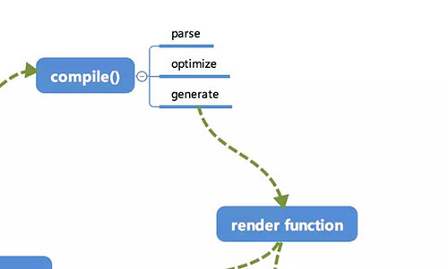

# template 模板是怎样通过 Compile 编译的

## compile
compile 编译可以分成 parse、optimize 与 generate 三个阶段，最终需要得到 render function。这部分内容不算 Vue.js 的响应式核心，只是用来编译的，笔者认为在精力有限的情况下不需要追究其全部的实现细节，能够把握如何解析的大致流程即可。




由于解析过程比较复杂，直接上代码可能会导致不了解这部分内容的同学一头雾水。所以准备提供一个 template 的示例，通过这个示例的变化来看解析的过程。但是解析的过程及结果都是将最重要的部分抽离出来展示，希望能让读者更好地了解其核心部分的实现。
```html
<div :class="c" class="demo" v-if="isShow">
    <span v-for="item in sz">{{item}}</span>
</div>
```
```js
var html = '<div :class="c" class="demo" v-if="isShow"><span v-for="item in sz">{{item}}</span></div>';
```
接下来的过程都会依赖这个示例来进行。

## parse
首先是 parse，parse 会用正则等方式将 template 模板中进行字符串解析，得到指令、class、style等数据，形成 AST（在计算机科学中，抽象语法树（abstract syntax tree或者缩写为AST），或者语法树（syntax tree），是源代码的抽象语法结构的树状表现形式，这里特指编程语言的源代码。）。

这个过程比较复杂，会涉及到比较多的正则进行字符串解析，我们来看一下得到的 AST 的样子。

```js
{
    /* 标签属性的map，记录了标签上属性 */
    'attrsMap': {
        ':class': 'c',
        'class': 'demo',
        'v-if': 'isShow'
    },
    /* 解析得到的:class */
    'classBinding': 'c',
    /* 标签属性v-if */
    'if': 'isShow',
    /* v-if的条件 */
    'ifConditions': [
        {
            'exp': 'isShow'
        }
    ],
    /* 标签属性class */
    'staticClass': 'demo',
    /* 标签的tag */
    'tag': 'div',
    /* 子标签数组 */
    'children': [
        {
            'attrsMap': {
                'v-for': "item in sz"
            },
            /* for循环的参数 */
            'alias': "item",
            /* for循环的对象 */
            'for': 'sz',
            /* for循环是否已经被处理的标记位 */
            'forProcessed': true,
            'tag': 'span',
            'children': [
                {
                    /* 表达式，_s是一个转字符串的函数 */
                    'expression': '_s(item)',
                    'text': '{{item}}'
                }
            ]
        }
    ]
}
```
